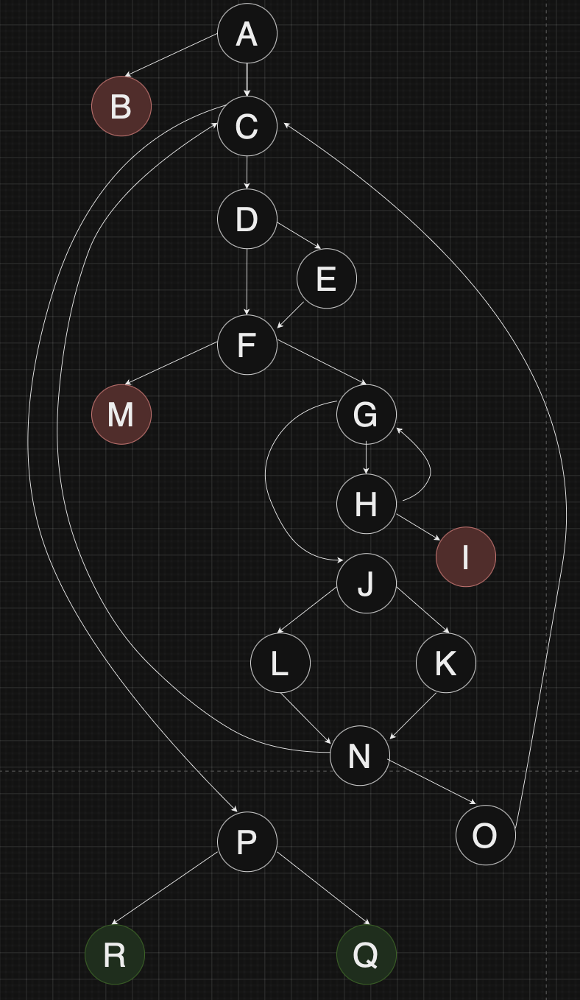

# Втора лабораториска вежба по Софтверско инженерство

## Тихомир Јанев, бр. на индекс 203264

### Control Flow Graph

### Цикломатска комплексност

#### Цикломатската комплексност ја добив преку формулата за пресметување на цикломатска комплексност преку предикатни јазнли ( V(G) = P + 1 ), каде што бројот на предикатни јазли во кодот е 9 и по додавање 1 од формулата добивам 10. Цикломатската комплексност е 10.

### Тест случаи според Every branch критериумот:

#### Вкупниот број на врски е 22 и тие се : AB,AC,CP,CD,DE,DF,EF,FM,FG,GH,GJ,HI,HG,JL,JK,LN,KN,NO,NC,DC,PR,PQ.

#### тест пример бр. 1 е да пратимне празна листа SILab2.checkCart(null,1000) и со тоа ќе се исполни врската:

- [X] AB

#### тест пример бр. 2 е new Item = item("",32412,100,0), SILab2.checkCart(item,1000)

#### тест пример бр. 3 е  new Item = item ("Ime",null,100,0), SILab2.checkCart(item,1000)

#### тест пример бр. 4 е  new Item = item ("Ime",432TTTa43,100,0), SILab2.checkCart(item,1000)

#### тест пример бр. 5 е  new Item = item ("Ime",123443,100,0.44), SILab2.checkCart(item,1000)

#### тест пример бр. 6 е  new Item = item ("Ime",0565665,500,0.44), SILab2.checkCart(item,1000)

#### тест пример бр. 7 е  new Item = item ("Ime",56568,1000,0), SILab2.checkCart(item,1000)

#### тест пример бр. 8 е  new Item = item ("Ime",66743,1000,0), SILab2.checkCart(item,2000)

#### со овие тест примери ги опфаќам врските помеѓу јазлите(се подразбира дека праќаме листа во фукнцијата ова е само севдо код како би изгледало):

- [X] AC
- [X] CP
- [X] CD
- [X] DE
- [X] EF
- [X] DF
- [X] FM
- [X] FG
- [X] GH
- [X] GJ
- [X] HI
- [X] JL
- [X] JK
- [X] LN
- [X] KN
- [X] NO
- [X] NC
- [X] OC
- [X] PR
- [X] PQ
- [X] HG

### Сите тест случаи според Multiple Condition критериумот за условот if (item.getPrice() > 300 && item.getDiscount() > 0 && item.getBarcode().charAt(0) == '0')

#### тест пример бр. 1 е new Item = item("Tiho",032412,350,0.2), SILab2.checkCart(item,1000)

#### тест пример бр. 2 е  new Item = item ("Tiho",032412,350,0), SILab2.checkCart(item,1000)

#### тест пример бр. 3 е  new Item = item ("Tiho",4321232,350,0.2), SILab2.checkCart(item,1000)

#### тест пример бр. 4 е  new Item = item ("Tiho",123443,100,0.44), SILab2.checkCart(item,1000)

#### Овие тест примери ги добивам по логиката дека имам 2 на 3та варијанти, но најважни ми се (True,True,True),(False,nebitno,nebitno),(True,False,Nebitno) i (True,True,False) бидејки се работи за конјункција.

### Тест примерите ги правам по логиката од прашање 4.